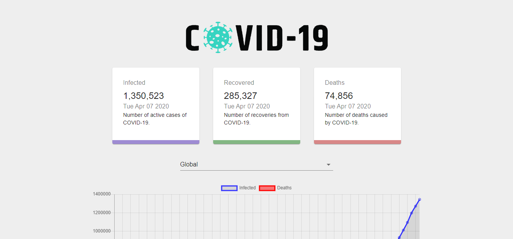
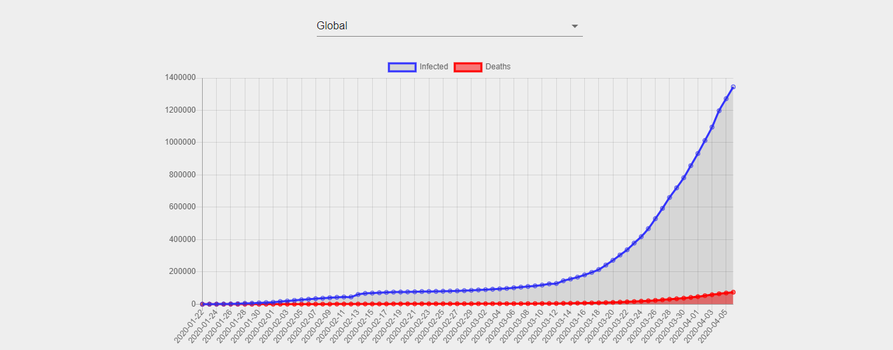

React App Corona Counter

This is an app that shows the live stats of the Corona Virus update:

This App derives the Corona results from the John Hopkins University: In three Categories, Infected, Dead and Recovered.

This uses the https://covid19.mathdro.id/api

The demo can be found at: https://covid-19-7feda.web.app/
